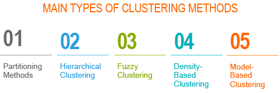

# Clustering Methods

## Purpose

The goal of this project is to look deeper into one of the most common methods of grouping objects on the basis of their similarity. The K-means and EM algorithm can both be used for this general purpose but differ in their strengths and weaknesses.

## Packages

The comparison is done using generated data from the bivariate normal distribution. Below is a list of the packages used.

1. [MASS](https://cran.r-project.org/web/packages/MASS/index.html): For generating bivariate data.
2. [ggplot2](https://cran.r-project.org/web/packages/ggplot2/index.html): For beautiful plots.
3. [cluster](https://cran.r-project.org/web/packages/cluster/index.html): Functions for clustering.
4. [factoextra](https://cran.r-project.org/web/packages/factoextra/index.html): ggplot2 compatible silhoutte plots.

Most of the important functions were written by myself for instructive purposes. To view the project in a browser, visit the link beside the repository description in the code tab.