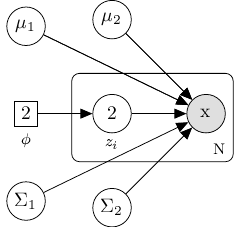

# Introduction

The task of identifying distinct clusters for which data objects may be assigned to involves many different procedures, each with thier own advantages and disadvantes. Which method is the most efficient at accomplishing the objective is dependent on the structure of the data. Two of the most recognized kinds of algorithms used are K-means and expectation maximization, which fall under the category of unsupervised learning techniques. This is because we assume that the target labels (which cluster each data object belongs to) is unknown. To measure the relative quality of a clustering method it is necessary to compare the intra-class similarity and inter-class similarity between data objects. Through this type of analysis the patterns and structure of the data should become more apparent. Thus, a typical application would be for exploratory data analysis, or preprocessing for use with other algorithms.


# Data and Model

We will be working with synthetic data generated from a Gaussian mixture density. In particular we use two mixture components, each having a bivariate normal distribution, parameterized by means $\mu_1, \mu_2 \in \mathbb{R}^2$, and covariance matrices  $\Sigma_1, \Sigma_2 \in \mathbb{R}^{2\times2}$. Therefore the model for the data will be:
$$
f(\mathbf{x}, \theta) = \phi_1\mathcal{N}(\mathbf{x} \, | \, \mu_1, \Sigma_1) + \phi_2\mathcal{N}(\mathbf{x} \, | \, \mu_2, \Sigma_2)
$$
where $\theta$ represents all relevant parameters, and $\phi_i$ denote the mixing coefficients.

## Identifiability
Let $K$ be the convex hull of the class of all two-component mixtures of bivariate normal distributions:
$$
K = \bigg\{f(\cdot) : f(\cdot)= \phi_1\mathcal{N}(\mathbf{x} \, | \, \mu_1, \Sigma_1) + \phi_2\mathcal{N}(\mathbf{x} \, | \, \mu_2, \Sigma_2), \phi_i>0, \phi_1 + \phi_2 =1 \bigg\}
$$
Then consider using the following parameter values: 

$$
\mu_1 = \begin{bmatrix}0.1 \\ 0.1\end{bmatrix} \quad \mu_2 = \begin{bmatrix}6.0 \\ 0.1 \end{bmatrix} \quad \sum_1 = \sum_2 = \begin{bmatrix} 10 & 7 \\ 7 & 10 \end{bmatrix} \quad \phi_i=1/2
$$
We would obtain the same population distribution if instead $\mu_1 = \begin{bmatrix}6.0 \\ 0.1 \end{bmatrix}$ and $\mu_2 = \begin{bmatrix}0.1 \\ 0.1\end{bmatrix}$. Therefore $\mu_1, \mu_2$ are not identifiable. However, this is not a major concern since it is immaterial how we order the components. All that is required is either to partition the data into two clusters (as in K-means), or to estimate the parameters of the assumed subpopulations (as in EM).

## Data Generation

Since we are interested in comparing performance between two clustering algorithms we wish to preserve the class label indicating which sample data point came from which subpopulation. When we then implement K-means and EM over the data we will hide the label and report misclassifications.

```{r}
library(MASS) # for multivariate normal gen
library(ggplot2) # aesthetic plotting
set.seed(101)
# Parameters
mu_1 <- c(0.1, 0.1); mu_2 <- c(6.0, 0.1)
Sigma <- matrix(c(10, 7, 7, 10), nrow = 2)
# Generate two samples
sample_1 <- mvrnorm(n=200, mu=mu_1, Sigma = Sigma)
sample_2 <- mvrnorm(n=200, mu=mu_2, Sigma = Sigma)

sample <- rbind(sample_1, sample_2) # matrix format
colnames(sample) <- c("X1", "X2")
classes <- c(rep(1, 200), rep(2, 200))
data <- as.data.frame(sample) # data frame format
data["Class"] <- as.factor(classes)
```

## Data Plots {.tabset}

### Without labels

```{r echo=FALSE, fig.show= "hold", fig.align='center', fig.cap="Generated Bivariate Normal Data", out.width="50%"}
p <- ggplot(data, aes(X1, X2, color=factor(1))) +
  geom_point() + theme_bw()
legend <- theme(legend.position = c(0.9, 0.2))
p + legend + scale_color_brewer(palette="Dark2")
ggplot(data, aes(X1, X2)) + geom_density_2d(colour="red") + theme_bw()
```

### With labels

```{r echo =FALSE, fig.align='center', fig.cap="Generated Bivariate Normal Data", out.width="50%"}
p <- ggplot(data, aes(X1, X2, color = Class)) +
  geom_point() + stat_ellipse(type = "norm") + theme_bw()
legend <- theme(legend.position = c(0.9, 0.2))
p + legend + scale_color_brewer(palette="Dark2")
```

## Number of clusters

In this analysis we know how the data was generated and so we do not feign ignorance. A discussion of determining the optimal number of clusters will be delayed, and so two are assumed. The amount of separation between the two clusters seems problematic. Looking at the contour plot, we see that two peaks are likely present and so our assumption has some evidence of validity.


# K-Means
Given data the data generated according to the previous section: $\mathbf{x}_1, \dots , \mathbf{x}_{400}$, with $\mathbf{x}_i\in\mathbb{R}^2$; our objective is to partition the data into two sets such that the *within-cluster sum of squares* (WCSS) is at a minimum. The WCSS *cost* function is defined as:
$$
J=\sum_{n=1}^N\sum_{k=1}^Kr_{nk} \|\mathbf{x}_n - \mathbf{\mu} \|^2_{2}
$$

## Vanilla Algorithm
Given mean $\mu_k$,

1. E-step: Minimize $J$ with respect to $r_{nk}$:
$$
r_{nk} =
\begin{cases}
1 & ;k= arg \min_j \|\mathbf{x}_n-\mu_j \|^2 \\
0 & ; \text{otherwise}
\end{cases}
$$
2. Given $r_{nk}$ minimize $J$ with respect to $\mu_k$,
$$
\mu_k = \frac{\sum_{n}r_{nk}\mathbf{x}_n}{\sum_{n}r_{nk}}
$$

The algorithm has converged when there ceases to be any change in mean assignments or the maximum number of iterations is reached. It's important to note that this does not guarantee convergence to a global optimum, only a local one. Thus, performance may depend on the method of centroid initialization. We will return to this subject after the following implementation.

With $K=2$:
```{r}
cost <- function(x, centroid, R) {
  sum((x - t(centroid) %*% t(R)) ** 2)
}

km_e_step <- function(x, centroid, A) {
  norm_vec <- function(y) sqrt(sum(y^2)) # euclidean norm
  for (i in 1:nrow(A)) {
    dist_1 <- norm_vec(x[,i] - centroid[1,])
    dist_2 <- norm_vec(x[,i] - centroid[2,])
    k <- which.min(c(dist_1, dist_2))
    # assign r[i,k]
      if (k == 1) {
        A[i,] <- c(1,0)
      } else {
        A[i,] <- c(0,1)
      }
  }
  A
}

km_m_step <- function(x, centroid, A) {
  C1 <- x %*% A[,1] / sum(A[,1])
  C2 <- x %*% A[,2] / sum(A[,2])
  centroid <- matrix(c(C1,C2),ncol=2,byrow = TRUE)
  centroid
}

km_ <- function(x, centroid, R, max.iter) {
  cost_old <- 1L
  cost_new <- 0
  i <- 0
  cost_vec <- c()
  while ((cost_new != cost_old) & (i < max.iter)) {
    R <- R <- km_e_step(x, centroid, R)
    cost_old <- cost(x, centroid, R)
    cost_vec <- c(cost_vec, cost_old)
    centroid <- km_m_step(x, centroid, R)
    cost_new <- cost(x, centroid, R)
    cost_vec <- c(cost_vec, cost_new)
    i <- i + 1
  }
  cluster <- apply(t(R), FUN = which.max, MARGIN = 2)
  r <- list(centroid=centroid, R=R, cluster=cluster, cost=cost_vec)
  r
}
```

## Initializing centroids
Before letting the algorithm run we must choose initial centroid locations. This choice can have an effect on overall performance of the procedure as mentioned earlier. Typically we would get better performance when the inital centroid are not assigned too close together. One way to approach this is called *K-means++*, see *k-means++: The Advantages of Careful Seeding* http://ilpubs.stanford.edu:8090/778/1/2006-13.pdf.

1. Uniformly assign one data point as the first initial centroid.
2. Compute the euclidean distance between the centroid and all other data points.
3. Assign the next centroid to a data point with probability proportional to its squared distance from the first centroid.
```{r}
X <- sample
centr.init <- X[sample(nrow(X), size=1), ] # initial centroid
e.dist <- sqrt(rowSums((X-centr.init)^2)) # compute distance
probs <- e.dist^2 / (max(e.dist)^2 + 1)
centr.new <- X[sample(nrow(X), size=1, prob=probs), ]
```


```{r}
X <- t(X)
R <- matrix(0, nrow=ncol(X), ncol=2)
centroid <- matrix(c(centr.init, centr.new),ncol=2,byrow=TRUE)
r <- km_(X, centroid, R, max.iter = 20)
mc_err <- mean(classes != r$cluster)
```

```{r echo=FALSE, fig.show = "hold", fig.cap="Results of K-means", out.width="50%"}
data <- data.frame("X1"=X[1,], "X2"=X[2,], "Class"=factor(r$cluster))
ggplot(data, aes(x=X1, y=X2, col=Class)) + geom_point() +
  geom_point(aes(x=r$centroid[1,1],y=r$centroid[1,2]),
             size=5, shape=3, color="red", stroke=2) +
  geom_point(aes(x=r$centroid[2,1],y=r$centroid[2,2]),
             size=5, shape=3, color="red", stroke=2) +
  theme_bw() + scale_color_brewer(palette="Dark2")


conv <- data.frame("Iterations" = 1:length(r$cost), "Cost" = r$cost)
ggplot(conv, aes(Iterations, Cost)) + geom_line() + geom_point() + theme_bw()
```

## Results of K-Means
The misclassification error is then `r mc_err`. From the resulting scatterplot we can see that the algorithm converged to a local minimum, which resulted in a suboptimal split. The dependence of the cost function on euclidean distance implies that this method would work best on spherical clusters. The results would also likely be different depending on the number of clusters we assumed. 

## Silhouette analysis

A silhoutte analysis will help to give an idea of how well each observation is suited for its assigned cluster, and help to compare the results assuming different numbers of clusters. The silhoutte value will be a score from -1 to +1, where higher values are an indication of a good assignment (being very similar to other points within its cluster), and lower values signifying a poorer assignment. We can use the average silhoutte score given by running K-means with different numbers of clusters specified and look for a maximum. 


```{r, echo=F}
suppressMessages(suppressWarnings(library(cluster)))
suppressMessages(suppressWarnings(library(factoextra)))
```
```{r}
nc <- data.frame("K"=1:10, "avg.width"=numeric(10))
for (i in 2:10) {
  km.r <- kmeans(sample, i)
  sil <- silhouette(km.r$cluster, dist(sample))
  sil <- summary(sil)
  nc$avg.width[i] <- sil$avg.width
}
```

## Validation Plots {.tabset}

### Two assumed clusters

```{r echo=FALSE, fig.show="hold", out.width="50%"}
ggplot(nc, aes(K,avg.width)) + geom_point(shape = 18, size = 3) +
  geom_line() + geom_vline(xintercept = 2, linetype="dashed", size = 1.2, color = "red") + theme_bw()
r1 <- eclust(sample, "kmeans", k = 2,
                 nstart = 25, graph = FALSE)
fviz_silhouette(r1, print.summary = FALSE) +
  scale_fill_brewer(palette = "Dark2") +
  scale_color_brewer(palette = "Dark2") +
  theme_bw()+
  theme(axis.text.x = element_blank(), axis.ticks.x = element_blank())
```

### Three assumed clusters

```{r echo=FALSE, fig.show="hold", out.width="50%"}
ggplot(nc, aes(K,avg.width)) + geom_point(shape = 18, size = 3) +
  geom_line() + geom_vline(xintercept = 3, linetype="dashed", size = 1.2, color = "red") + theme_bw()
r2 <- eclust(sample, "kmeans", k = 3,
                 nstart = 25, graph = FALSE)
fviz_silhouette(r2, print.summary = FALSE) +
  scale_fill_brewer(palette = "Dark2") +
  scale_color_brewer(palette = "Dark2") +
  theme_bw()+
  theme(axis.text.x = element_blank(), axis.ticks.x = element_blank())
```
 
## 
The silhoutte method of validation suggests that two clusters is optimal. However, these heruistic methods have their disadvantages. An alternative approach is to use the *gap statistic*, or to instead of K-means use *hierarchal clustering*, which avoids the problem altogether.

The two steps of K-means involve computing first, an expectation, and second, finding a minimum (which can be shown to be equivalent to finding a maximum). Thus, K-means can be seen as a variant of a more flexible model -- the expectation maximization algorithm (EM).


# EM

For the EM algorithm we adopt the perspective of having data with latent variables, which specify membership to distinct subpopulations. From the parametric model proposed in an earlier section,


Modeling the data used above as a mixture of two bivariate Gaussians; then for a given datapoint $\mathbf{x}$,
$$
p(\mathbf{x}) = \phi_1 \mathcal{N}(\mathbf{x} |\mathbf{\mu}_1, \Sigma) + \phi_2 \mathcal{N}(\mathbf{x} |\mathbf{\mu}_2, \Sigma)
$$
For each datapoint observed there is a corresponding latent variable $\mathbf{z}_n$. We can model the structure of conditional dependence between the parameters and variables by using a directed acyclic graph:

```{r pressure, echo=F, out.width = '30%', fig.align='center'}

```

With respect to the latent variables $\mathbf{z}_n$, Bayes' Theorem leads us to the following formulation,
$$
\gamma(z_{nk}) = P\{z_{nk} = 1 \, | \, \mathbf{x} \} = \frac{\phi_k\mathcal{N}(\mathbf{x} |\mathbf{\mu}_k, \Sigma)}{\phi_1 \mathcal{N}(\mathbf{x} |\mathbf{\mu}_1, \Sigma) + \phi_2 \mathcal{N}(\mathbf{x} |\mathbf{\mu}_2, \Sigma)}
$$
Thus the parameters to be estimates are denoted by $\mathbf{\theta} = \{\mathbf{\mu}_1, \mathbf{\mu}_2, \phi_1, \phi_2, \Sigma \}$. Under the assumption of latent variables we consider the complete data likelihood to be
$$
p(\mathbf{X}, \mathbf{Z} \, | \, \mathbf{\theta}) = \prod_{n=1}^N \bigg\{ \bigg[\phi_1\mathcal{N}(\mathbf{x}_n |\mathbf{\mu}_1, \Sigma)\bigg]^{z_{n1}} \bigg[\phi_2 \mathcal{N}(\mathbf{x}_n |\mathbf{\mu}_2, \Sigma) \bigg]^{z_{n2}} \bigg\}
$$
and so the complete data log-likelihood is
$$
log \,p(\mathbf{X}, \mathbf{Z} \, | \, \mathbf{\theta}) = \sum_{n=1}^N\bigg\{ z_{n1}log\phi_1 + z_{n1} \, log \,\mathcal{N}(\mathbf{x}_n |\mathbf{\mu}_1, \Sigma) + z_{n2}log \phi_2 + z_{n2} \, log \, \mathcal{N}(\mathbf{x}_n |\mathbf{\mu}_2, \Sigma) \bigg\}
$$
leading to the maximum likelihood estimates
$$
\begin{aligned}
  \widehat{\phi}_k &= N_k/N \quad w.\,\, N_k = \sum_{n=1}^N \gamma_k(z_{nk}) \\
  \widehat{\mathbf{\mu}}_k &= \frac{1}{N_k}\sum_{n=1}^N \gamma_k(z_{nk})x_n \\
  \Sigma_k^{\dagger} &= \frac{1}{N_k}\gamma_k(z_{nk})(\mathbf{x}_n - \mathbf{\mu}_k)(\mathbf{x}_n - \mathbf{\mu}_k)^T
\end{aligned}
$$

## Algorithm
First we must initialize $\theta_0$. Then,

1. E-Step: Compute $\gamma(z_{nk})$ using $\theta_0$
2. M-Step: Re-estimate the model parameters using the maximum likelihood estimates shown above.
3. Iterate over steps one and two until convergence.

Convergence is reached when the change to expected log-likelihood after an interation is within our specified tolerance. Mathematically,
$$
\mathbb{E}_{\mathbf{Z}|\theta^{(t+1)},\mathbf{X}}[log(\theta^{(t+1)}\,|\,\mathbf{Z},\mathbf{X})] \leq \mathbb{E}_{\mathbf{Z}|\theta^{(t)},\mathbf{X}}[log(\theta^{(t)}\,|\,\mathbf{Z},\mathbf{X})] + \epsilon
$$
where $\epsilon$ is our tolerance. We will set this to be $10^{-4}$.

We will need to make use of the following function to compute the multivariate Gaussian density. However, care must be taken as it involved inverting a covariance matrix. The base solve function in R can provide results that are ruined by rounding error. Since the covariance matrix is an SPD (semi) matrix the Cholesky factorization is a natural choice for speed and numerical stability.
```{r}
normal_density <- function(x, mean, sigma) {
  cf <- chol(sigma)
  tmp <- backsolve(cf, t(x) - mean, transpose = TRUE)
  rss <- colSums(tmp^2)
  lv <- -sum(log(diag(cf))) - 0.5 * ncol(x) * log(2 * 
            pi) - 0.5 * rss
  exp(lv)
}
```
Below is the implementation of the EM algorithm.
```{r}
e_step <- function(x, theta) {
  # extract each parameter from theta -- a list
  mix.p <- c(theta[[1]], theta[[2]])
  mu_1 <- theta[[3]]; mu_2 <- theta[[4]]
  Sigma_1 <- theta[[5]]
  Sigma_2 <- theta[[6]]
  
  a <- mix.p[1] * normal_density(x, mean=mu_1, sigma=Sigma_1)
  b <- mix.p[2] * normal_density(x, mean=mu_2, sigma=Sigma_2)
  resp_1 <- a / (a+b)
  resp_2 <- b / (a+b)
  r <- list("loglik"=sum(log(a+b)), "responsibilities"=cbind(resp_1, resp_2))
  r
}

m_step <- function(x, resps) {
  mu_1.dagger <- as.vector(crossprod(resps[,1],x) / sum(resps[,1]))
  mu_2.dagger <- as.vector(crossprod(resps[,2],x) / sum(resps[,2]))
  
  Sigma_1.dagger <- t(resps[,1] * t(apply(x, 1, function(x) x - mu_1.dagger))) %*% 
    (resps[,1] * t(apply(x, 1, function(x) x - mu_1.dagger))) * 1/sum(resps[,1])
  Sigma_2.dagger <- t(resps[,2] * t(apply(x, 1, function(x) x - mu_2.dagger))) %*% 
    (resps[,2] * t(apply(x, 1, function(x) x - mu_2.dagger))) * 1/sum(resps[,2])
  
  pi_1.dagger <- sum(resps[,1]) / 400
  pi_2.dagger <- sum(resps[,2]) / 400
  
  r <- list(p1=pi_1.dagger, p2=pi_2.dagger, mu1=mu_1.dagger, mu2=mu_2.dagger,
            sig1=Sigma_1.dagger, sig2=Sigma_2.dagger)
  r
}

EM <- function(x, init, max.iter, tol=10e-4) {
  for (i in 1:max.iter) {
    if (i == 1) {
      E_ <- e_step(x, init)
      M_ <- m_step(x, E_$responsibilities)
      old.loglik <- E_$loglik
      loglik.vec <- E_$loglik
    } else {
      E_ <- e_step(x, M_)
      M_ <- m_step(x, E_$responsibilities)
      loglik.vec <- c(loglik.vec, E_$loglik)
      condition <- abs((E_$loglik - old.loglik))
      if (condition < tol) {
        break
      } else {
        old.loglik <- E_$loglik
      }
    }
  }
  list(p1=M_$p1, p2=M_$p2, mu1=M_$mu1, mu2=M_$mu2,
       sig1=M_$sig1, sig2=M_$sig2,
       responsibilities = E_$responsibilities, loglik = loglik.vec)
}
```

## Initializing Parameters
In this analysis we naively initialize both covariance matrices as $\Sigma = \begin{bmatrix} 2 & 0 \\ 0 & 2 \end{bmatrix}$, and $\mu_1 = (0,0)^T, \, \mu_2 = (1,1)^T$. Using our results from k-means we see that the proportion of data points assigned to each class is:
```{r}
r1$size / ncol(X)
```
Suggesting that $\phi_1=\phi_2 = 1/2$, will be a good initial candidate (as we secretly already know).


```{r}
theta.init <- list(0.5, 0.5, c(0,0), c(1,1), diag(2), diag(2))
res <- EM(sample, theta.init, 100)
pred <- apply(res$responsibilities, 1, function(row) which.max(row))
mc_err2 <- mean(pred != classes)
```
Difference in misclassification error: kmeans: `r mc_err`, EM: `r mc_err2`.
```{r echo=FALSE, fig.show = "hold", fig.cap="Clustering by EM", out.width="50%"}
data <- data.frame(X1 = sample[,1], X2 = sample[,2], "Class" =  as.factor(pred))
data$p <- apply(res$responsibilities, 1, max) # uncertainty of assignment
p <- ggplot(data, aes(X1, X2, color = Class, alpha = p)) +
  geom_point() + stat_ellipse(type = "norm") +
  theme_bw() + scale_color_brewer(palette="Dark2")
p

conv <- data.frame("Iterations" = 1:length(res$loglik), "LogLikelihood" = res$loglik)
p <- ggplot(conv, aes(Iterations, LogLikelihood)) + geom_line() + geom_point() + theme_bw() +
  ylim(range(res$loglik[2:length(res$loglik)])) + xlim(5,30)
suppressWarnings(print(p))
```
## Results of EM and Comparisons

From the above plots we can see that EM converges slowly (in about 25-30 iterations). The scatterplot indicates a much better fit to the structure of the data, as we would expect, since the data was generated from a mixture of Gaussians. The K-Means is very clearly biased with respect to the $L_2$ norm and so fails to capture the same structure. Another difference between these two procedures to take into consideration is how they each partition the data. K-means performs *hard partitioning*, by assigning each observation to one particular cluster. EM, on the other hand uses *soft partitioning* through the calculation of the expectation of an observation belonging to one cluster or the other. Thus, through EM we get for free, the probability that any observation belongs to each cluster in addition to estimates of the underlying model parameters. The uncertainty of each assignment is shown through the opacity of each observation in the scatterplot. Clearly, the most uncertain assignments occur where the seperation between clusters is smallest.  It is also worth noting that the generative EM model, is able to produce new observations. We would simply need to generate a bivariate normal data point with the parameters estimated in EM. For example, we can produce a sample observation from a subpopulation:
```{r}
mvrnorm(n=1, mu=res$mu1, Sigma = res$sig1)
```

# Summary of Analysis

Uncovering this sort of knowledge of our data is one of the advantages of performing a cluster analysis. No single procedure will work well universally and so we must apply these steps of exploration in an iterative fashion until we achieve better results. To wrap up, we will generate 10 independent realizations of the bivariate Gaussian data and see how the algorithms compare with respect to misclassification errors.

```{r}
data <- list()
for (i in 1:10) {
  sample_1 <- mvrnorm(n=200, mu=mu_1, Sigma = Sigma)
  sample_2 <- mvrnorm(n=200, mu=mu_2, Sigma = Sigma)
  sample <- rbind(sample_1, sample_2)
  colnames(sample) <- c("X1", "X2")

  data_i <- as.data.frame(sample)
  data_i["Class"] <- as.factor(c(rep(1, 200), rep(2, 200)))
  data[[i]] <- data_i
}
new_results <- data.frame("K_Means"=numeric(10),
                          "EM"=numeric(10),
                          "Absolute_Diff"=numeric(10))
for (i in 1:10) {
  X <- t(data[[i]][,c("X1", "X2")])
  r1 <- km_(X, centroid, R, max.iter=20)
  mc_err1 <- mean(classes != r1$cluster)
  new_results$K_Means[i] <- mc_err1
  
  r2 <- EM(t(X), theta.init, 20)
  pred <- apply(r2$responsibilities, 1, function(row) which.max(row))
  mc_err2 <- mean(classes != pred)
  new_results$EM[i] <- mc_err2
}
new_results$Absolute_Diff <- abs(new_results$K_Means - new_results$EM)
new_results
```

From the above table we can see that performance depends greatly on the data. This is mainly due to the strong dependence on initial parameters for a good fit. There are also methods for choosing initial parameters which will give better results than those above, where we simply reused our earlier initializations. Ultimately, EM is much better suited for capturing the structure since the data was generated from a mixture of Gaussians. If the clusters were better seperated, both methods would give similair results but K-means converges faster.


* To experiment with an interactive application, generating new data, and applying the procedures, click here: https://derekwayne.shinyapps.io/KM_and_EM/

* A possible future edit would be to include an implementation of the various methods of parameter initialization for EM.


